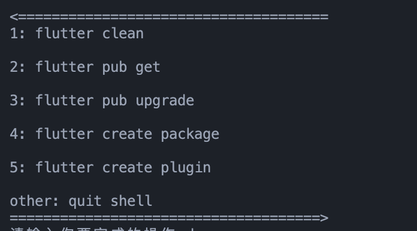

# shell
个人使用的shell

---

    # 统计代码行数
    code_line_language
    
    # 使用方法
    code_line_language dart

---

    # flutter项目快捷操作工具
    # 解决flutter clean清除不彻底的问题
    # 解决vscode无法创建package、plugin的痛点
    flutter_shell_tools
    
    # 使用方法
    flutter_shell_tools

    # 提供的功能
    清除项目缓存，包含`flutter clean`不会删除的`.flutter-plugins`,`.flutter-plugins-dependencies`文件
    所有模块执行get
    所有模块执行upgrade
    创建package
    创建plugin

